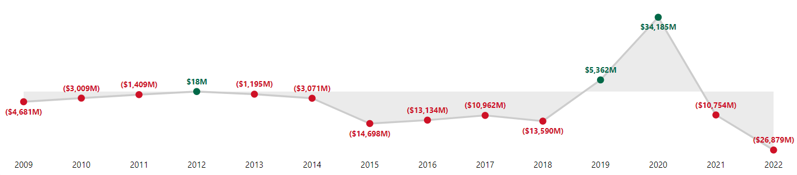
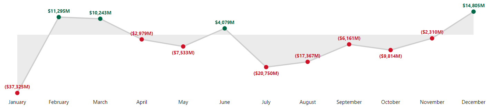
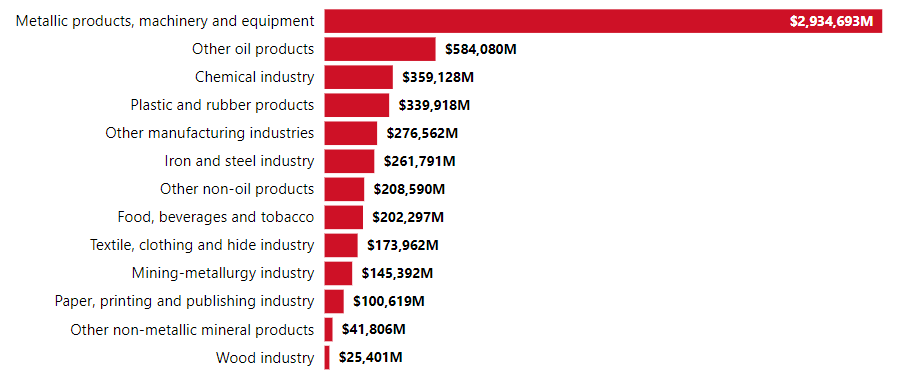
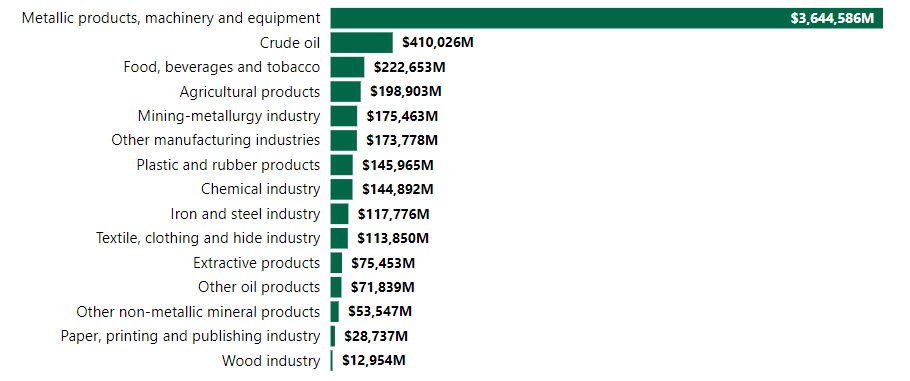
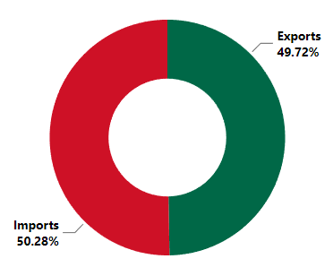
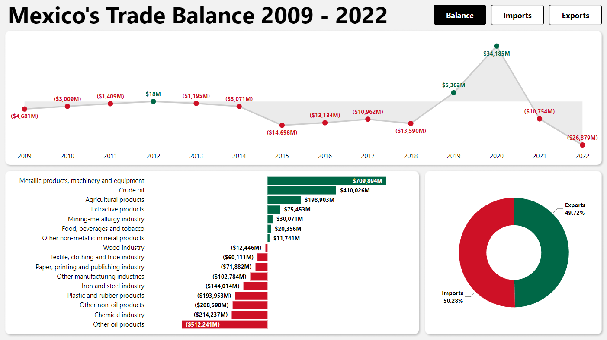
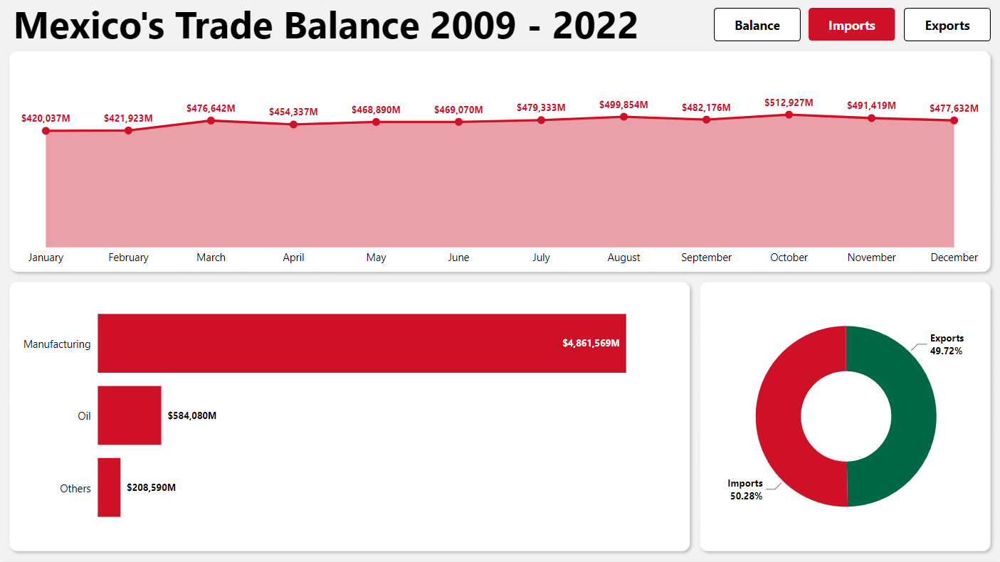

# Analysis of Mexico's Trade Balance 2009-2022 

## Table of Contents

- [Introduction](#introduction)
- [Objective](#objective)
- [Data source](#data-source)
- [Methods](#methods)
- [Tools](#tools)
- [Analysis results](#analysis-results)
- [What can be improved](#what-can-be-improved)
- [Dashboard](#dashboard)

## Introduction

Foreign trade is an important part of Mexico's economy, accounting for about 82% of GDP in 2022 according to the Bank of Mexico, which is why Mexico has signed more than a dozen free trade agreements with about forty different countries. As a Mexican, I was curious about how the trade balance had evolved and what Mexico's top imports and exports were, so I took the opportunity to build this project and develop my data analysis skills and knowledge.

## Objective

Analyze Mexico's Trade Balance behavior for the period 2009 to 2022 by creating an interactive dashboard to answer the following key questions:

- How has the trade balance changed during this period?
- Which year had the largest trade surplus?
- Which year had the largest trade deficit?
- In total, which month had the largest trade surplus?
- In total, which month had the largest trade deficit?
- What imported product did Mexico spend the most on?
- Which export product has earned Mexico the most?
- Did Mexico have more spending or more income during this period?

## Data source

The "trade_balance" dataset was obtained from the [Mexican National Institute of Statistics and Geography (INEGI)](http://en.www.inegi.org.mx/app/descarga/).

The dataset can be found [here](https://github.com/AlexVegaR/Analysis-of-Mexicos-Trade-Balance-2009-2022/tree/main/dataset).

## Methods

- Data gathering
- Data wrangling
- Exploratory data analysis
- Data visualization

## Tools

- **Power BI**: Power Query, DAX

## Analysis results

During the period from 2009 to 2022, Mexico's trade balance was mostly in deficit, with the only years with a trade surplus being 2012, 2019 and 2020.

There is no clear pattern as the trade balance has been in constant ups and downs, with the best year being 2020 with a trade surplus of $34,185 million and the worst year being 2022 with a trade deficit of $26,879 million.

Overall, the best month was December with a trade surplus of $14,805 million and the worst was January with a deficit of $37,325 million.

The import items on which Mexico spent the most were those related to metallic products, machinery and equipment, with $2,934,693 million, more than five times the amount spent on the second most imported items, which are other oil products, with $584,080 million spent.

As in the case of imported goods, the export items on which Mexico earned the most were those related to metallic products, machinery and equipment, with $3,644,586 million, more than eight times the amount earned on the second most exported item, crude oil, with $410,026 million.

Although there is not too much difference between the percentage of imports and exports, Mexico spent significantly more on imported goods than it earned on exports during this period, resulting in a trade deficit throughout these years.

## What can be improved

- The dataset is not very specific about the products in each category, so, for example, agricultural and extractive products only have data for exports because the same products are classified as other non-oil products on imports. I could find and pay for a better labeled and classified dataset than the free one provided by INEGI.
- Each trade category works with a different set of charts. Therefore, the filters on the visuals are not maintained when the category is changed. I could add slicers to make it easier to filter data and find specific information within the dashboard.

## Dashboard

The online Power BI dashboard can be found [here](https://app.powerbi.com/view?r=eyJrIjoiNzc4ZGYwZjAtNjBjNi00OGRlLTkzMjQtNjY4OTE5NTg1NjdlIiwidCI6IjI2NjZiNGUyLWU2MjctNDA2OS05YzkwLWJkNTUxNDQyMjQ0NyIsImMiOjR9).

The Power Query M code used to cleanse and prepare the data can be found [here](https://github.com/AlexVegaR/Analysis-of-Mexicos-Trade-Balance-2009-2022/blob/main/power_query_m_code/Trade%20Balance.pq).

